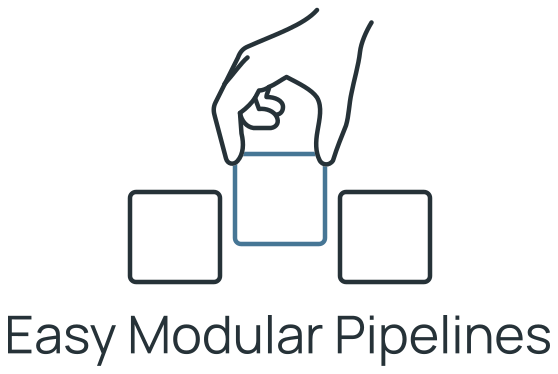

<h1 align="center">
  <picture>
    <source media="(prefers-color-scheme: dark)" srcset="docs/assets/logo-dark.svg">
    
  </picture>
</h1>

Easy Modular Pipelines is a Python framework for building reproducible AI
experiments from versioned modules. Describe an experiment in YAML, run its
stages, and inspect results, logs, resources, and artifacts through the CLI or
dashboard.

> [!IMPORTANT]
> This is a new project under active development. Bugs are possible, and APIs,
> configuration, and stored experiment formats may change. Compatibility with
> older experimental formats is not guaranteed.

## What it does

- Runs sequential stages and long-lived services with explicit inputs,
  settings, timeouts, and retry policies.
- Checks module versions and hashes before execution.
- Supports pause, step, resume, stop, snapshots, recovery, and exchange archives.
- Records operations and results in a shared journal.
- Provides a separate dashboard for history, live state, artifacts, resource
  monitoring, and alerts.

Stages currently run sequentially; branching and parallel stage execution are
not supported. See [current capabilities](docs/basic_dag.md#current-limits).

## Installation

### From source

Use Python 3.12 and `uv`. Clone the repository and install the locked environment:

```text
git clone https://github.com/ShiftingBorders/easy-modular-pipelines.git
cd easy-modular-pipelines
uv sync --locked
```

Run project commands through `uv run` from this checkout. The managed module
store also needs the SeaweedFS executable: `core/seaweedfs/weed.exe` on Windows
or `core/seaweedfs/weed` on Linux. Alternatively, configure an existing Filer
with `--filer-url`; see [module storage](docs/storage.md).

Follow the [quickstart](docs/quickstart.md) to register the example modules,
start the server, and run your first experiment.

### PyPI (soon)

A supported PyPI installation workflow is planned. Use the source installation
above for now.

## Documentation

| Task | Guide |
| --- | --- |
| Run your first experiment | [Quickstart](docs/quickstart.md) |
| Use commands, configuration and the interactive shell | [CLI reference](docs/cli.md) |
| Create a stage module | [Module authoring](docs/instructions/modules.md) |
| Create a service or external-process proxy | [Service authoring](docs/instructions/python_bridges.md) |
| Configure and run experiments | [Experiment guide](docs/basic_dag.md) |
| Understand the experiment YAML | [Template reference](docs/experiment_template.md) |
| Debug a run | [Debugging](docs/debugging.md) |
| Use the web interface | [Dashboard](docs/dashboard.md) |
| Browse all guides and API references | [Documentation index](docs/README.md) |

## Development

```text
uv run python -m unittest discover -s tests -p "test_*.py" -v
```

See [testing](docs/testing.md) for requirements and optional suites.
[AGENTS.md](AGENTS.md) defines contribution boundaries and the approval process
for adding or changing tests.
